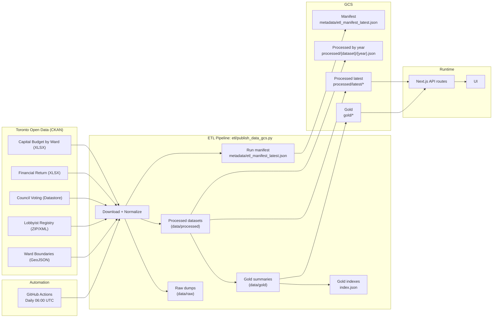

# Toronto Money Flow v0.002

A Next.js dashboard for Toronto procurement, capital investment, money flow, and council decisions. Procurement data is fetched live from CKAN. Budget and governance data is pulled via ETL and served as JSON from gold summaries in GCS (with processed data as fallback).

## Product Spec

- v0.002 scope and acceptance criteria: see `Toronto_Money_Flow_v0.002_Spec.md`

## ETL Flow (Mermaid)



## What it does

Analyzes Toronto city spending and governance across four lenses:

### 1. Procurement Contracts (real-time)
Fetches contract data from [Toronto Bids Awarded Contracts](https://open.toronto.ca/dataset/tobids-awarded-contracts/) and [Non-Competitive Contracts](https://open.toronto.ca/dataset/tobids-non-competitive-contracts/):

- Total contract values (competitive and non-competitive)
- Vendor concentration metrics (Top 1 and Top 10 vendor shares)
- Non-competitive share (percentage of total spend and contracts)
- Top vendors (top 10 vendors by awarded amount)
- Division breakdown (top 8 divisions by spend)
- Category breakdown (top 10 procurement categories)
- Median award size (typical contract value)
- Governance health indicators (with thresholds)

### 2. Capital Investment by Ward (ETL)
Analyzes [Capital Budget by Ward](https://open.toronto.ca/dataset/budget-capital-budget-plan-by-ward-10-yr-approved/) to show geographic distribution:

- Total capital investment (planned infrastructure and projects)
- City-wide vs ward-specific split
- Top 5 and bottom 5 wards comparison
- Ward disparity ratio (top vs bottom ward)
- Ward map visualization (choropleth)
- Investment categories (top 5 categories by spend)
- Largest projects with ward and program details
- Progressive disclosure toggle for categories and projects

### 3. Money Flow (Revenue vs Spending) (ETL)
Summarizes how money comes in and goes out of the city budget:

- Revenue vs expenditure totals
- Top and bottom 7 funding sources
- Top and bottom 7 spending categories
- Surplus or deficit balance

#### Money Flow Caveats
The Financial Information Return (FIR) mixes annual flows with balance-sheet rollups (e.g., "Accumulated Surplus", "Continuity of...", and PLUS/LESS totals).
We explicitly filter those rows to avoid double-counting. This is why raw totals can drop significantly after filtering.
We also extract the FIR summary totals (PLUS: Total Revenues / LESS: Total Expenses) into a separate `financial_return_totals.json` file and surface them as
`reportedTotal` fields alongside the line-item sums. The UI uses FIR reported totals for the headline figures when available; the breakdown uses line-item
totals, and the gap is shown as reconciliation items.
The Money Flow UI includes a short explainer describing the reconciliation gap (consolidation/deferral/transfer adjustments) without inventing amounts.

### 4. Council Decisions (Governance) (ETL)
Tracks recent council activity and lobbying context:

- Recent motions and outcomes (passed/failed)
- Decision categories (transportation, housing, environment, etc.)
- Councillor participation (votes cast and absences)
- Lobbying activity summary (top subjects, communications count)

## Data Tiers

The project uses a three-tier data architecture optimized for performance and cost:

### Gold Tier (Pre-aggregated Summaries)
- **Purpose**: Pre-computed API responses ready for UI consumption
- **Location**: `data/gold/` locally, `gs://{bucket}/gold/` in GCS
- **Size**: 4-14KB per file (99% smaller than processed files)
- **Format**: One JSON file per year for money-flow, capital, and council decisions, plus a rolling council summary
- **Index**: `gold/money-flow/index.json`, `gold/capital/index.json`, and `gold/council-decisions/index.json` list available years and per-year URLs
- **Generation**: Created during ETL by `publish_data_gcs.py`
- **Benefits**:
  - Eliminates runtime aggregation (faster API responses)
  - Avoids Next.js cache limits (no 2MB overflow errors)
  - Reduces bandwidth costs (smaller file transfers)

### Processed Tier (Full Normalized Datasets)
- **Purpose**: Complete datasets used as fallback if gold tier unavailable
- **Location**: `data/processed/` locally, `gs://{bucket}/processed/latest/` in GCS (plus per-year splits)
- **Size**: 50KB - 71MB per file
- **Format**: One JSON file per dataset (all years combined), plus per-year files for capital, money-flow, council, and lobbyist
- **Usage**: APIs load these only if gold files missing, then aggregate at runtime

### Raw Tier (ETL Intermediates)
- **Purpose**: Temporary files during ETL processing
- **Location**: `data/raw/` locally only (not uploaded to GCS)
- **Lifecycle**: Ephemeral, recreated on each ETL run

**API Behavior**: APIs read gold indexes to determine available years, fetch gold summaries when possible, and fall back to processed data if gold is missing.

## Quick Start

```bash
# Install dependencies
npm install

# Run locally
npm run dev
```

Then open http://localhost:3000

## Project Structure

```
toronto-money-flow/
├── app/
│   ├── layout.js
│   ├── page.js
│   └── api/
│       ├── _lib/
│       │   └── load-json.js
│       ├── metric/
│       │   └── route.js
│       ├── capital-by-ward/
│       │   └── route.js
│       ├── money-flow/
│       │   └── route.js
│       ├── council-decisions/
│       │   └── route.js
│       └── ward-map/
│           └── route.js
├── etl/
│   ├── config.yaml
│   ├── config_loader.py
│   ├── capital_by_ward_etl.py
│   ├── financial_return_etl.py
│   ├── council_voting_etl.py
│   ├── lobbyist_registry_etl.py
│   ├── publish_data_gcs.py
│   ├── requirements.txt
│   └── README.md
├── scripts/
│   └── publish_data_gcs.sh
├── data/
│   ├── gold/
│   ├── raw/
│   └── processed/
├── package.json
└── next.config.js
```

## How it works

### Data Pipeline

The project uses an automated ETL pipeline that runs daily:

**ETL outputs (see `etl/README.md` for details):**
1. Capital Budget by Ward -> `capital_by_ward.json` (and `capital_by_ward.csv`, plus `data/processed/capital-by-ward/{year}.json`)
2. Financial Return (revenue and expenses) -> `financial_return.json` (plus `data/processed/financial-return/{year}.json`)
3. Council Voting Records -> `council_voting.json` (plus `data/processed/council-voting/{year}.json`)
4. Lobbyist Registry Activity -> `lobbyist_activity.json` (plus `data/processed/lobbyist-registry/{year}.json`)
5. Ward Boundaries (GeoJSON) -> `ward_boundaries.geojson`
6. ETL run manifest -> `data/processed/metadata/etl_manifest_latest.json`

Note: Capital per-year files include planned future years from the 10-year plan (projections).

**Gold outputs (API-ready summaries):**
1. Money Flow summaries -> `data/gold/money-flow/{year}.json`
2. Capital summaries -> `data/gold/capital/{year}.json`
3. Council Decisions summaries -> `data/gold/council-decisions/{year}.json` + rolling `summary.json`
4. Trends -> `data/gold/money-flow/trends.json`, `data/gold/capital/trends.json`, `data/gold/council-decisions/trends.json`
5. Gold indexes -> `data/gold/money-flow/index.json`, `data/gold/capital/index.json`, `data/gold/council-decisions/index.json`
6. RAG index -> `data/gold/rag/index.json`

**Automation:**
- All ETL scripts are orchestrated by `etl/publish_data_gcs.py`
- `scripts/publish_data_gcs.sh` runs the orchestrator via `uv`
- GitHub Actions runs the publish step daily (6 AM UTC)
- Configuration is centralized in `etl/config.yaml`

### API Layer

**Procurement contracts (live CKAN):**
- `/api/metric` fetches data directly from CKAN datastore resources
- Aggregates totals, concentration metrics, and top groups

**Capital investment (ETL-based):**
- `/api/capital-by-ward` reads the gold index from `GCS_BASE_URL` (or `CAPITAL_GOLD_INDEX_URL` override) and loads the per-year gold file
- Falls back to `capital_by_ward.json` (GCS via `CAPITAL_DATA_URL` override) if gold is missing
- Returns totals, top/bottom wards, category breakdown, and top projects

**Money flow (ETL-based):**
- `/api/money-flow` reads the gold index from `GCS_BASE_URL` (or `MONEY_FLOW_GOLD_INDEX_URL` override) and loads the per-year gold file
- Falls back to `financial_return.json` (GCS via `FINANCIAL_RETURN_URL` override) if gold is missing
- Returns top and bottom 7 revenue and expenditure groups plus balance

**Council decisions (ETL-based):**
- `/api/council-decisions` reads `gold/council-decisions/{year}.json` when `?year=` is set (or falls back to the rolling summary)
- Falls back to `council_voting.json` and `lobbyist_activity.json` if gold is missing

**Ward map (ETL-based):**
- `/api/ward-map` reads `ward_boundaries.geojson` from `GCS_BASE_URL` (or `WARD_GEOJSON_URL` override)
- Merges ward geometry with capital investment totals

## Deployment

### App environment variables (runtime)

Required:
- `GCS_BASE_URL` (example: `https://storage.googleapis.com/standardize-journalism-data`)

Optional overrides (rare):
- `MONEY_FLOW_GOLD_INDEX_URL`
- `CAPITAL_GOLD_INDEX_URL`
- `COUNCIL_SUMMARY_URL`
- `CAPITAL_DATA_URL`
- `FINANCIAL_RETURN_URL`
- `VOTING_DATA_URL`
- `LOBBYIST_DATA_URL`
- `WARD_GEOJSON_URL`

### Automated ETL (GitHub Actions)

The repository includes automated ETL via `.github/workflows/etl-pipeline.yml`:

**Setup (one-time):**
1. Configure GitHub Secrets:
   - `GCP_PROJECT_ID`
   - `GCS_BUCKET_NAME`
   - `GCP_WORKLOAD_IDENTITY_PROVIDER`
   - `GCP_SERVICE_ACCOUNT`
2. Configure GCP Workload Identity

**Runs automatically:**
- Daily at 6 AM UTC (1 AM EST)
- Manual trigger via workflow_dispatch

### Manual publish to GCS

```bash
chmod +x scripts/publish_data_gcs.sh
CREATE_BUCKET=0 MAKE_PUBLIC=0 ./scripts/publish_data_gcs.sh
```

**GCS paths**:
- Council Decisions (gold): `gs://{bucket}/gold/council-decisions/{year}.json`
- Council Summary (gold, rolling): `gs://{bucket}/gold/council-decisions/summary.json`
- Council Index: `gs://{bucket}/gold/council-decisions/index.json`
- Ward Boundaries: `gs://{bucket}/ward-boundaries/ward_boundaries.geojson`
- Processed Latest (stable fallback):
  - `gs://{bucket}/processed/latest/capital_by_ward.json`
  - `gs://{bucket}/processed/latest/financial_return.json`
  - `gs://{bucket}/processed/latest/council_voting.json`
  - `gs://{bucket}/processed/latest/lobbyist_activity.json`
- Processed Capital by Year: `gs://{bucket}/processed/capital-by-ward/{year}.json`
- Processed Money Flow by Year: `gs://{bucket}/processed/financial-return/{year}.json`
- Processed Council by Year: `gs://{bucket}/processed/council-voting/{year}.json`
- Processed Lobbyist by Year: `gs://{bucket}/processed/lobbyist-registry/{year}.json`
- Gold Money Flow: `gs://{bucket}/gold/money-flow/{year}.json`
- Gold Money Flow Index: `gs://{bucket}/gold/money-flow/index.json`
- Gold Money Flow Trends: `gs://{bucket}/gold/money-flow/trends.json`
- Gold Capital: `gs://{bucket}/gold/capital/{year}.json`
- Gold Capital Index: `gs://{bucket}/gold/capital/index.json`
- Gold Capital Trends: `gs://{bucket}/gold/capital/trends.json`
- Gold Council Trends: `gs://{bucket}/gold/council-decisions/trends.json`
- Gold RAG Index: `gs://{bucket}/gold/rag/index.json`
- ETL Manifest (latest): `gs://{bucket}/metadata/etl_manifest_latest.json`

### External data hosting

If hosting JSON externally (GCS or CDN), set the base URL:

```
GCS_BASE_URL=https://your-host
```

Optional overrides (only if you need to point a specific dataset elsewhere):

```
MONEY_FLOW_GOLD_INDEX_URL=https://your-host/gold/money-flow/index.json
CAPITAL_GOLD_INDEX_URL=https://your-host/gold/capital/index.json
COUNCIL_SUMMARY_URL=https://your-host/gold/council-decisions/summary.json
COUNCIL_INDEX_URL=https://your-host/gold/council-decisions/index.json
COUNCIL_TRENDS_URL=https://your-host/gold/council-decisions/trends.json
RAG_INDEX_URL=https://your-host/gold/rag/index.json
CAPITAL_DATA_URL=https://your-host/processed/latest/capital_by_ward.json
FINANCIAL_RETURN_URL=https://your-host/processed/latest/financial_return.json
VOTING_DATA_URL=https://your-host/processed/latest/council_voting.json
LOBBYIST_DATA_URL=https://your-host/processed/latest/lobbyist_activity.json
WARD_GEOJSON_URL=https://your-host/ward-boundaries/ward_boundaries.geojson
```

When gold URLs are set, APIs read the index/summary first and only fall back to processed data if gold is missing.

## Data Sources

All data is sourced from [Toronto Open Data](https://open.toronto.ca/):

**ETL Pipeline:**
- Capital Budget by Ward (XLSX)
- Financial Information Return (Schedules 10 and 40) (XLSX)
- Council Voting Records (Datastore API)
- Lobbyist Registry Activity (ZIP/XML)
- Ward Boundaries (GeoJSON)

**Real-time API:**
- Awarded Contracts (Datastore API)
- Non-Competitive Contracts (Datastore API)

CKAN Base URL: `https://ckan0.cf.opendata.inter.prod-toronto.ca`

## v0.002 Features (Current)

**Procurement governance:**
- Vendor concentration metrics (Top 1, Top 10 share)
- Non-competitive contract share (amount and count)
- Category and division breakdowns
- Median award size calculation
- Governance health indicators and caveats

**Capital investment by ward:**
- ETL pipeline for XLSX normalization
- City-wide vs ward-specific analysis
- Top 5 / bottom 5 ward comparison
- Ward disparity ratio
- Ward map visualization
- Category and project detail toggle

**Money flow:**
- Revenue vs spending totals
- Top and bottom funding sources
- Surplus or deficit balance

**Council decisions:**
- Recent motions and outcomes
- Decision category breakdown
- Councillor participation summary
- Lobbyist activity summary

**General:**
- Year selector (recent years; data availability varies by section)
- External data URLs supported via environment variables

## AI Chat Assistant

### What It Does

The Toronto Money Flow dashboard includes an AI-powered chat assistant that helps users explore the data through natural language questions. The chatbot:

- Answers questions **strictly from gold data summaries** (no external knowledge)
- Provides source citations for every answer
- Uses simple, teen-friendly language
- Refuses to answer questions outside its data scope
- Supports both Anthropic Claude and OpenAI GPT models

**Floating widget** appears in the bottom-right corner of the dashboard. Click to open, ask questions, and view responses with sources.

### How It Works

**Data-Bounded Responses:**
The chatbot is strictly limited to answering from available data sources (no external knowledge):
- Gold summaries and trends (money flow, capital, council)
- Processed records for detail filters (capital projects, council votes, lobbyist activity)
- Live CKAN for procurement metrics

If the answer isn't in the data, the chatbot politely refuses and explains its limitations.
Responses include both a data file reference (gold/processed/CKAN when applicable) and the related API endpoint when available.

**Routing (Tools + RAG):**
The chat stack uses an LLM tool router with strict validation, then falls back to RAG (filters/embeddings):
- LLM router (`tool-router.js`) selects a tool + params using the schemas, then gets validated and normalized.
- Tool results return immediately with a structured response envelope (no LLM rewrite by default).
- If no tool applies, the system uses entity filters or embeddings.
- If neither returns data, the system fails closed with a "no answer" response.

```text
User question
  |
  v
LLM Tool Router (tool-router)
  |-- match --> Tool Executor --> response (retrievalType=tool)
  |
  v
Entity Filters (processed-retriever)
  |-- hits --> RAG response (ragStrategy=filters)
  |
  v
Embeddings Search (rag-retriever)
  |-- hits --> RAG response (ragStrategy=embeddings)
  |
  v
Fail-closed response (no answer)
```

**Routing metadata:**
- `metadata.retrievalType` is always either `tool` or `rag`.
- For `tool`, `metadata.tool` and `metadata.toolDataset` identify the exact tool used.
- For `tool`, `metadata.toolRoutingConfidence` reflects the router confidence score (0-1).
- For `rag`, `metadata.ragStrategy` is one of `filters` or `embeddings`.

**System Prompt Enforcement:**
A strict system prompt ensures:
- Only answers from provided data
- Concise responses (2-3 sentences max)
- Always cites sources
- Formats currency as CAD
- Uses simple language for teenage audience

### Configuration

**Required:**
```bash
# Choose your LLM provider
LLM_PROVIDER=anthropic  # or 'openai'

# Anthropic API key (if using Claude)
ANTHROPIC_API_KEY=sk-ant-api03-xxxxx

# OR OpenAI API key (if using GPT)
OPENAI_API_KEY=sk-xxxxx
```

**Optional:**
```bash
# Anthropic model (default: claude-3-5-sonnet-20241022)
ANTHROPIC_MODEL=claude-3-5-sonnet-20241022

# OpenAI model (default: gpt-4o-mini)
OPENAI_MODEL=gpt-4o-mini

# Enable chat logging to data/logs/chat_history.jsonl (default: false)
CHAT_ENABLE_LOGGING=true

# Optional: override log directory
# Defaults to data/logs locally, /tmp/standardize-journalism-logs in production
# CHAT_LOG_DIR=/tmp/standardize-journalism-logs

```

### Rate Limiting

To prevent abuse while allowing educational exploration:
- **20 messages per minute** per user
- Token bucket algorithm (refills at 20 tokens/minute)
- Client identified by IP + User-Agent
- In-memory storage (no external dependencies)

If rate limited, users see a friendly message with retry time.

### Suggested Questions

The chat widget displays suggested questions to help users get started:
- "What was Toronto's biggest expense in 2024?"
- "Which ward got the most capital funding?"
- "How much did the city spend on transit?"
- "What was the budget surplus or deficit?"
- "What decisions did council make recently?"
- "How much was spent on police?"

### Scope and Limitations

**What it CAN answer:**
- Questions about Toronto's budget, revenue, and expenses
- Questions about capital projects and ward investments
- Questions about council decisions and voting patterns
- Questions about lobbying activity
- Year-specific queries (if data available for that year)

**What it CANNOT answer:**
- Questions unrelated to Toronto municipal government
- Questions about data it doesn't have
- Speculative or hypothetical questions
- Questions requiring external knowledge
- Questions about future budgets outside the published capital plan

Note: Capital plan years are labeled as planned allocations (not final actuals).

**Privacy:**
- API keys are server-side only (never exposed to browser)
- Optional logging stores: timestamp, message, answer, sources, IP (not full User-Agent)
- Production logs default to `/tmp` unless `CHAT_LOG_DIR` is set
- No conversation history persistence (each session starts fresh)

### Architecture

**Backend:**
- `/api/chat` - Main chat endpoint (Next.js API route)
- `/api/chat/health` - Health check (gold data + provider config)
- `app/api/_lib/llm-providers.js` - Provider abstraction (Claude/OpenAI)
- `app/api/_lib/rate-limiter.js` - Token bucket rate limiting
- `app/api/_lib/context-builder.js` - Tool routing + RAG context builder
- `app/api/_lib/tool-router.js` - LLM tool router with guardrails
- `app/api/_lib/tool-executor.js` - Deterministic tool execution
- `app/api/_lib/response-builder.js` - Structured response envelopes

**Frontend:**
- `app/components/ChatWidget.js` - Floating widget UI
- `app/components/ChatMessage.js` - Message bubbles
- `app/components/SuggestedQuestions.js` - Question chips

**Server-side only:**
- All LLM API calls happen server-side
- No client-side API keys or model access
- `runtime: 'nodejs'` and `dynamic: 'force-dynamic'`

## Next Steps (v0.003)

**High priority:**
- Operating budget by program ETL
- Operating vs capital comparison
- Year-over-year trends for operating spend

**Medium priority:**
- Per-capita ward investment (requires population data)
- Deeper ward map interactions (click to highlight/lock)
- Time-series charts for capital investment

**Low priority:**
- Export to CSV
- Additional UI filters and drill-down

## ETL (Capital Budget by Ward)

See `etl/README.md` for the ETL pipeline details.
