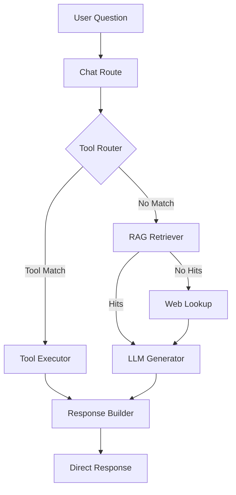
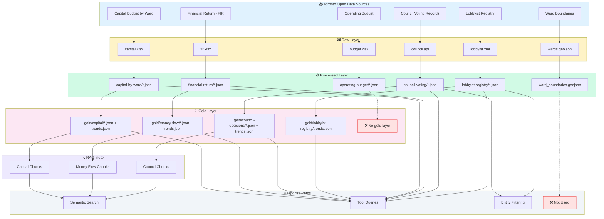

# LLM Chatbot Data Architecture

This document describes the complete data flow and architecture of the Toronto Money Flow chatbot, from raw data sources to LLM context.

---

## Architecture Overview



---

## Key Implementation Files

| Component | File | Purpose |
|-----------|------|---------|
| Main Route | [route.js](file:///Users/aasibipin/standardize-journalism/app/api/chat/route.js) | Entry point, orchestration |
| Tool Router | [tool-router.js](file:///Users/aasibipin/standardize-journalism/app/api/_lib/tool-router.js) | LLM-based tool selection |
| Tool Definitions | [tool-definitions.js](file:///Users/aasibipin/standardize-journalism/app/api/_lib/tool-definitions.js) | 10 available tools |
| Tool Executor | [tool-executor.js](file:///Users/aasibipin/standardize-journalism/app/api/_lib/tool-executor.js) | Tool implementation |
| RAG Retriever | [rag-retriever.js](file:///Users/aasibipin/standardize-journalism/app/api/_lib/rag-retriever.js) | Semantic search |
| Web Lookup | [web-lookup.js](file:///Users/aasibipin/standardize-journalism/app/api/_lib/web-lookup.js) | Government site fallback |
| Context Builder | [context-builder.js](file:///Users/aasibipin/standardize-journalism/app/api/_lib/context-builder.js) | Hybrid retrieval orchestration |

---

## Tools Available (10 Total)

1. `count_records` - Count meetings, motions, projects
2. `sum_amount` - Sum spending (capital, money-flow)
3. `budget_balance` - Compute surplus/deficit
4. `compare_years` - Year-over-year comparisons
5. `council_metrics` - Pass rate, meeting count
6. `top_k` - Top items by metric
7. `procurement_metrics` - Contract totals
8. `get_motion_details` - Specific motion lookup
9. `glossary_lookup` - Budget term definitions
10. `web_lookup` - External site fallback

---

## Hallucination Mitigation

1. **Deterministic tools first** - Structured queries before LLM generation
2. **RAG with threshold** - `minScore = 0.55` filters low-confidence matches (configurable via `RAG_MIN_SIMILARITY_SCORE`)
3. **Fail closed** - Returns "I don't have data" rather than guessing
4. **Source attribution** - Responses cite data source used
5. **Allowlisted domains** - `toronto.ca`, `ontario.ca`, `canada.ca` only

---

## Web Fallback Implementation

- Uses **native search APIs** for each domain:
  - `toronto.ca` → Toronto site search API (`find.toronto.ca`)
  - `ontario.ca` → Ontario App Search API
  - `canada.ca` → Coveo search API
  - DuckDuckGo HTML parsing exists but is currently unused with the allowlist
- Rate-limited per conversation (5 lookups per 24h)
- Caches results (1hr HTML, 24hr PDF)
- PDF parsing support via `pdf-parse`

---

## Complete Data Flow Diagram



### Legend

| Symbol | Meaning |
|--------|---------|
| `→` Solid line | Data flows to next phase |
| `-→` Dashed line | No data flow / Not used |
| ❌ | Data source does not reach this phase |

### Summary by Data Source

| Source | Processed | Gold | RAG Indexed | LLM Access Method |
|--------|-----------|------|-------------|-------------------|
| Capital Budget | ✅ | ✅ | ✅ | Semantic search, Tools, Filtering |
| Financial Return | ✅ | ✅ | ✅ | Semantic search, Tools |
| Council Voting | ✅ | ✅ | ✅ | Semantic search, Tools, Filtering |
| Lobbyist Registry | ✅ | ✅ (trends only) | ❌ | Tools (trends when supported, processed fallback), Entity filtering (latest year default) |
| Operating Budget | ✅ | ❌ | ❌ | **Not exposed to chat** |
| Ward Boundaries | ✅ | ❌ | ❌ | **Visualization only** |

---

## Three Response Paths

### Path 1: Tool-Based (No RAG Index)

For structured queries (sums, counts, comparisons), tools query **gold trends first**, then fall back to processed files if trends are unavailable or don't contain the needed data.

> [!NOTE]
> Tool results return **directly to the user without an LLM call** (except `web_lookup` which uses LLM to synthesize web content). This ensures deterministic, fast responses for structured queries.

| Tool | Source Data | Example Query |
|------|-------------|---------------|
| `sum_amount` | `gold/capital/trends.json` (processed fallback) | "How much did Ward 5 get?" |
| `council_metrics` | `gold/council-decisions/trends.json` (processed fallback) | "What's the council pass rate?" |
| `top_k` | `gold/money-flow/trends.json` (processed fallback) | "Top 5 expenses in 2024?" |
| `glossary_lookup` | `app/data/city_budget_glossary.json` | "What is PIL?" |

**Response Payload:** Structured result from tool (not raw data).

```json
{
  "tool": "sum_amount",
  "result": {
    "total": 4250000000,
    "formatted": "$4.25B",
    "dataset": "capital",
    "year": 2024
  }
}
```

---

### Path 2: RAG Semantic Search (Gold → Embeddings → LLM)

For overview questions without specific entities, the system uses semantic search over **gold summaries**.

#### Step 1: Gold Summary Generation

| Source | Processing | Output |
|--------|------------|--------|
| `processed/financial-return/{year}.json` | Aggregate totals, top 5 groups | `gold/money-flow/{year}.json` |
| `processed/capital-by-ward/{year}.json` | Sum by ward/category, top wards | `gold/capital/{year}.json` |
| `processed/council-voting/{year}.json` | Motion counts, pass rates, recent decisions | `gold/council-decisions/{year}.json` |

#### Step 2: Text Chunk Creation

Each gold file is converted to a **human-readable text chunk** in [generate_embeddings.py](file:///Users/aasibipin/standardize-journalism/etl/generate_embeddings.py):

**Money Flow Chunk Example:**
```
MONEY FLOW DATA (2023):
Total Revenue: $18.42B
Total Expenditure: $17.89B
Balance: Surplus of $530M

Top Revenue Sources:
- Taxation - Own Purposes: $8.2B (44.5%)
- User Fees & Service Charges: $3.1B (16.8%)
- Provincial Grants: $2.4B (13.0%)

Top Expenditure Categories:
- Protection Services: $2.1B (11.7%)
- Transportation Services: $1.8B (10.1%)
- Social & Family Services: $1.6B (8.9%)
```

**Capital Chunk Example:**
```
CAPITAL PROJECTS (2024):
Total Investment: $3.42B
Ward-Specific: $2.1B across 25 wards
City-Wide: $1.32B (847 projects)

Top Wards by Investment:
- Ward 10 (Spadina-Fort York): $187M, 42 projects
- Ward 13 (Toronto Centre): $165M, 38 projects

Top Categories:
- State of Good Repair: $1.8B (523 projects)
- Health & Safety: $890M (215 projects)
```

**Council Chunk Example:**
```
COUNCIL DECISIONS (2024):
Total Motions: 847
Passed: 789
Failed: 58
Pass Rate: 93.2%

Top Decision Categories:
- Infrastructure: 142 motions, 95.8% pass rate
- Housing: 98 motions, 88.4% pass rate

Recent Decisions:
- Housing Accelerator Fund Allocation (passed, 92% yes)
- Emergency Shelter Expansion (passed, 88% yes)

Lobbying Activity:
- Active Registrations: 1,247
- Recent Communications: 3,891
- Top Subjects: Housing, Development, Transit
```

#### Step 3: Embedding Generation

| Field | Value |
|-------|-------|
| Model | `text-embedding-3-small` (OpenAI) |
| Dimensions | 1536 |
| Stored in | `gold/rag/index.json` |

Each chunk is stored with metadata:
```json
{
  "id": "money-flow-2023",
  "text": "MONEY FLOW DATA (2023): ...",
  "embedding": [0.0123, -0.0456, ...],  // 1536 floats
  "metadata": {
    "source": "gold/money-flow/2023.json",
    "type": "money-flow",
    "year": 2023
  }
}
```

#### Step 4: Retrieval at Query Time

1. User query → OpenAI embedding
2. Cosine similarity against all chunks
3. Filter by threshold (default: `0.55`, configurable via `RAG_MIN_SIMILARITY_SCORE`)
4. Return top 5 chunks

#### Step 5: LLM Context Assembly

The retrieved chunk **text** is concatenated and passed to the LLM:

```
You are a helpful assistant for the Toronto Money Flow dashboard...

DATA CONTEXT:
MONEY FLOW DATA (2023):
Total Revenue: $18.42B
...

---

CAPITAL PROJECTS (2024):
Total Investment: $3.42B
...

USER QUESTION: What was Toronto's budget surplus last year?
```

---

### Path 3: Entity-Based Filtering (Processed → LLM)

For queries with specific entities (ward, councillor, year, or lobbyist activity keywords), the system bypasses RAG and directly filters **processed** files.

#### Entity Extraction

| Entity | Extraction Method | Example |
|--------|-------------------|---------|
| Year | Regex `\b(20\d{2})\b` | "spending in **2024**" |
| Ward | Regex `ward\s*(\d+)` | "**Ward 10** projects" |
| Councillor | LLM extraction → canonicalization | "**Jamaal Myers** voting record" |
| Motion ID | Regex `[A-Z]{1,3}\d+\.\d+` | "motion **CC32.5**" |
| Lobbyist intent | Regex `\blobbyist|lobbying\b` + LLM keyword extraction | "lobbying activity in **2024**" |

#### Filtered Retrieval

1. Load `processed/council-voting/2024.json` (full dataset)
2. Filter by entity: `councillor_name.includes("Jamaal Myers")`
3. Format results as text for LLM:

```
COUNCIL VOTE DETAILS (2024):
Found 127 motions in 2024 (118 passed, 9 failed overall).

=== JAMAAL MYERS VOTING SUMMARY ===
Total motions participated in: 127
- Councillor voted YES: 119 motions
- Councillor voted NO: 7 motions
- Councillor was ABSENT: 1 motion

=== COMPLETE LIST OF MOTIONS JAMAAL MYERS VOTED AGAINST (7 total) ===
1. Emergency Shelter Expansion [CC24.15] - motion passed
2. Traffic Calming Deferral [CC24.28] - motion failed
...
```

> [!NOTE]
> Lobbyist detail queries default to the latest available year if no year is provided. Keyword filters are applied across lobbyist name, client, subject, and public office holder fields.

---

## What Is NOT Indexed

| Data | Location | Retrieval Method |
|------|----------|------------------|
| Individual capital projects | `processed/capital-by-ward/*.json` | Tool (`sum_amount`, `top_k`) or entity filtering |
| Individual council motions | `processed/council-voting/*.json` | Tool (`get_motion_details`) or entity filtering |
| Individual lobbyist records | `processed/lobbyist-registry/*.json` | Entity filtering only (latest year default) |
| Operating budget line items | `processed/operating-budget/*.json` | Not currently exposed to chat |

> [!IMPORTANT]
> **Processed data is NOT indexed for semantic search.** Only gold summaries are embedded. Processed data is accessed via deterministic tools or entity-based filtering.

---

## Data Freshness

| Layer | Update Frequency | Source |
|-------|------------------|--------|
| Processed | Daily (6 AM UTC) | GitHub Actions ETL |
| Gold | Daily (6 AM UTC) | Generated from processed |
| RAG Index | Daily (6 AM UTC) | Generated from gold |
| Runtime Cache | 1 hour TTL | In-memory on server |
